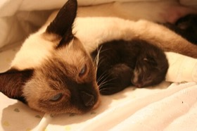
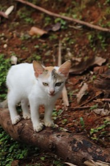
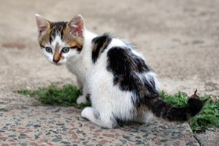
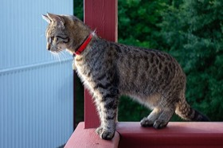
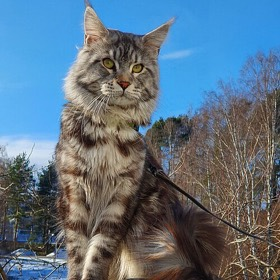
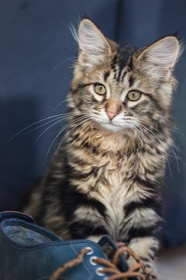
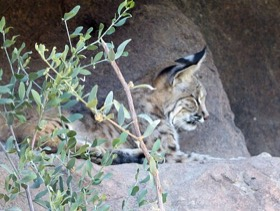
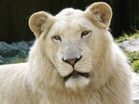
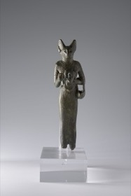

# Purr 2048 🐱→🦁→✨

A cat-themed [2048](https://en.wikipedia.org/wiki/2048_(video_game)). Merge matching cats and grow them from a tiny kitten up through the wild, the divine, and the cosmic — reach the **Great Sphinx (2048)** to win, then keep going to **transcend** into the stars.

Swipe or use the arrow keys. Match identical cats to merge them — and every merge plays a **random meow**. 🔊

The whole game is a single self-contained file: [`dist/index.html`](dist/index.html). All photos and sounds are embedded, so it runs anywhere with no external assets.

## The progression

Each tile value is its own cat, escalating from kitten to cat-god:

| Value | Cat | Stage |
|:-----:|:---:|:------|
| **2** |  | Tiny kitten |
| **4** |  | Kitten |
| **8** |  | Six-week-old kit |
| **16** |  | Juvenile tabby |
| **32** |  | Chonk (Maine Coon) |
| **64** |  | Lynx — gone wild |
| **128** |  | Tiger |
| **256** |  | 🦁 Lion |
| **512** |  | 👻 White lion — the *spirit* |
| **1024** |  | 🏺 Bastet — the cat *goddess* |
| **2048** |  | 🐈‍⬛ The Great Sphinx — *ancient god-beast* (the goal) |
| **4096** |  | ✨ Leo, the *cosmic constellation* — transcendence |

Reach **2048** (the Sphinx) to win — but the truly devoted keep merging up to the cosmic Leo.

See [`CREDITS.md`](CREDITS.md) for image and sound attribution (all public-domain / CC0 / CC-BY / CC-BY-SA, sourced from Wikimedia Commons; the value-2 and value-4 kittens are your own additions).

## Build & deploy

The game is generated from [`build/template.html`](build/template.html) plus the photos and
meows in [`assets/`](assets), all inlined into `dist/index.html`:

```sh
npm run build      # regenerate dist/index.html from assets/ + template
playground deploy  # build (above) + upload + publish to the playground
```

To swap a cat, drop a new `assets/cat_<value>.jpg` (e.g. `cat_256.jpg` for the lion tile),
re-run `npm run build`, and redeploy. Meows are any `assets/meow*.mp3` — add or remove files
and they're picked up automatically.

