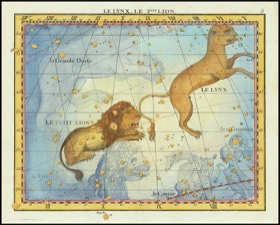

# Purr 2048 🐱→🦁→✨

A cat-themed [2048](https://en.wikipedia.org/wiki/2048_(video_game)). Merge matching cats and grow them from a tiny newborn kitten all the way up to a **majestic lion (2048)** — then keep going to **transcend the mortal cat realm**.

Swipe or use the arrow keys. Match identical cats to merge them — and every merge plays a **random meow**. 🔊

The whole game is a single self-contained file: [`dist/index.html`](dist/index.html). All photos and sounds are embedded, so it runs anywhere with no external assets.

## The progression

Each tile value is its own cat, ramping in size and grandeur:

| Value | Cat | Stage |
|:-----:|:---:|:------|
| **2** |  | Newborn kitten |
| **4** |  | Kitten |
| **8** |  | Six-week-old kit |
| **16** |  | Juvenile tabby |
| **32** |  | House cat |
| **64** |  | Chonk (Maine Coon) |
| **128** |  | Big cat (Siberian) |
| **256** |  | Lynx — gone wild |
| **512** |  | Leopard |
| **1024** |  | Tiger |
| **2048** |  | 🦁 **LION** — the goal |
| **4096** |  | 👻 White lion — the *spirit* |
| **8192** |  | 🏺 Bastet — the cat *goddess* |
| **16384** |  | 🐈‍⬛ The Great Sphinx — *ancient god-beast* |
| **32768** |  | ✨ Leo, the *cosmic constellation* — transcendence |

Reach **2048** (the lion) to win — but the truly devoted keep merging into the divine and cosmic tiers above.

See [`CREDITS.md`](CREDITS.md) for image and sound attribution (all public-domain / CC0 / CC-BY / CC-BY-SA, sourced from Wikimedia Commons).
